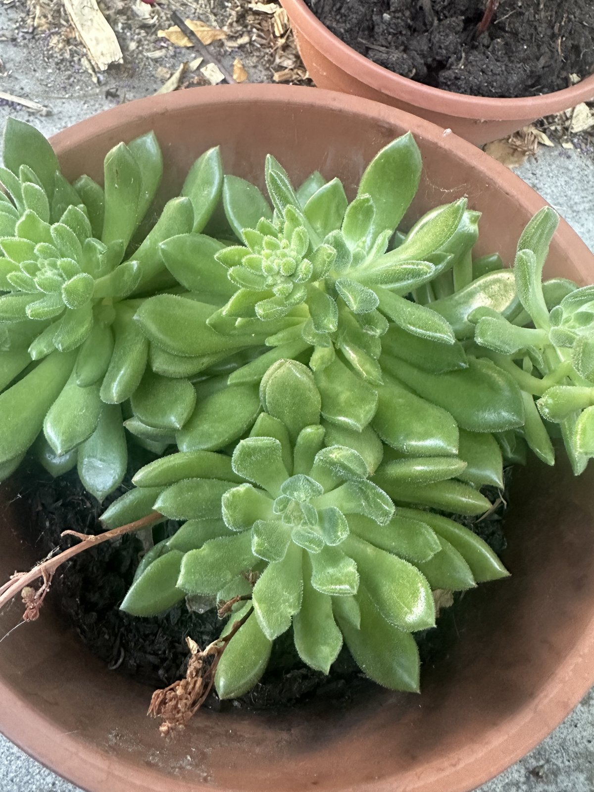

# Garden

A personal tracker for my garden in San Jose, CA. Each plant has a Markdown record covering what it
is, where it lives, where it came from, how it's doing, and how I care for it.

## How it's organized

```
plants/
  front/   side/   back/    # one file per plant, by location
  _TEMPLATE.md               # start a new record from this
docs/
  conventions.md             # record schema and naming rules
CLAUDE.md                    # working conventions for the repo
```

Records are Markdown with YAML frontmatter; images live beside the record they document.

## The garden

A thumbnail of each plant, grouped by location. Click any photo to open its record. This grid is
generated from the records — don't edit it by hand (see [Adding photos](#adding-photos)).

<!-- GALLERY:START -->
<!-- Generated by scripts/garden.py — do not edit by hand. Run `python3 scripts/garden.py gallery` after adding photos. -->

### Front

<table>
  <tr>
    <td width="280" valign="top"><a href="plants/front/amaryllis.md"></a><br><strong><a href="plants/front/amaryllis.md">Amaryllis</a></strong><br><em>Hippeastrum sp.</em><br>establishing</td>
    <td width="280" valign="top"><a href="plants/front/fig-natural-propagation.md"></a><br><strong><a href="plants/front/fig-natural-propagation.md">Fig (natural propagation)</a></strong><br><em>Ficus carica</em><br>establishing</td>
    <td width="280" valign="top"><a href="plants/front/kale.md"><em>no photo yet</em></a><br><strong><a href="plants/front/kale.md">Kale</a></strong><br><em>Brassica oleracea (Acephala group)</em><br>struggling</td>
  </tr>
  <tr>
    <td width="280" valign="top"><a href="plants/front/moorpark-apricot.md"><em>no photo yet</em></a><br><strong><a href="plants/front/moorpark-apricot.md">Moorpark Apricot</a></strong><br><em>Prunus armeniaca 'Moorpark'</em><br>establishing</td>
  </tr>
</table>

### Side

<table>
  <tr>
    <td width="280" valign="top"><a href="plants/side/fig-air-layer.md"></a><br><strong><a href="plants/side/fig-air-layer.md">Fig (air layer)</a></strong><br><em>Ficus carica</em><br>establishing</td>
    <td width="280" valign="top"><a href="plants/side/sedum.md"></a><br><strong><a href="plants/side/sedum.md">Sedum</a></strong><br><em>Sedum sp.</em><br>thriving</td>
  </tr>
</table>

### Back

<table>
  <tr>
    <td width="280" valign="top"><a href="plants/back/desert-gold-peach.md"></a><br><strong><a href="plants/back/desert-gold-peach.md">Desert Gold Peach</a></strong><br><em>Prunus persica 'Desert Gold'</em><br>thriving</td>
    <td width="280" valign="top"><a href="plants/back/echeveria-setosa.md"></a><br><strong><a href="plants/back/echeveria-setosa.md">Echeveria setosa</a></strong><br><em>Echeveria setosa</em><br>struggling</td>
    <td width="280" valign="top"><a href="plants/back/echeveria-shaviana.md"><em>no photo yet</em></a><br><strong><a href="plants/back/echeveria-shaviana.md">Echeveria shaviana</a></strong><br><em>Echeveria shaviana</em><br>establishing</td>
  </tr>
  <tr>
    <td width="280" valign="top"><a href="plants/back/fig-communal.md"><em>no photo yet</em></a><br><strong><a href="plants/back/fig-communal.md">Fig (communal)</a></strong><br><em>Ficus carica</em><br>thriving</td>
    <td width="280" valign="top"><a href="plants/back/zonal-geranium.md"></a><br><strong><a href="plants/back/zonal-geranium.md">Zonal Geranium (red)</a></strong><br><em>Pelargonium x hortorum</em><br>thriving</td>
  </tr>
</table>
<!-- GALLERY:END -->

## Adding or updating a plant

1. Read [`docs/conventions.md`](docs/conventions.md).
2. Copy [`plants/_TEMPLATE.md`](plants/_TEMPLATE.md) into the right location directory.
3. Fill the frontmatter and the sections that apply.
4. Open a PR — see [`CLAUDE.md`](CLAUDE.md) for the branch/PR flow.

## Adding photos

Phone photos are HEIC and **embed the exact GPS coordinates where they were taken** — they must
never be committed to this public repo. Always run them through the pipeline, which decodes the
HEIC, **strips all metadata**, resizes for the web, and writes a conventionally-named JPEG beside
the record:

```sh
python3 scripts/garden.py convert ~/path/to/IMG_1234.HEIC plants/back/desert-gold-peach.md
python3 scripts/garden.py gallery        # rebuild the grid above
```

Then set `cover:` in the record's frontmatter (optional — defaults to the newest photo) and embed
the image under `## Photos`. The raw HEIC stays out of git (`*.HEIC` is ignored). A CI check and
`python3 scripts/garden.py check` both fail if any HEIC or any image with location data is ever
committed, or if the gallery is out of sync. Requires Python 3 + Pillow; `convert` uses macOS `sips`.

## A note on privacy

This repository is public. Locations stay coarse (front / side / back), and records never contain a
street address, precise coordinates, or images with embedded location data.
