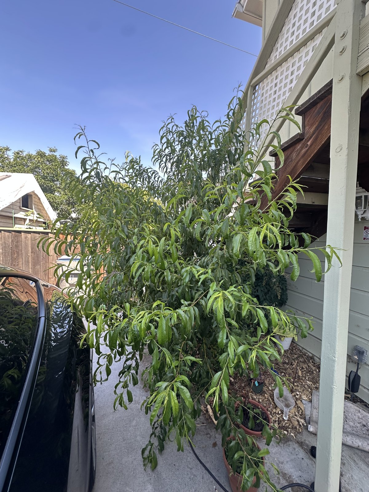

## Context

Planted as a sapling and now about 2m tall — one of my proudest outcomes. Highly precocious: it
fruited in its first year. The peaches are small but delicious. Heavy, leafy growth.

## Photos

*2026-06*

## Needs

Full sun. Low-chill variety, well suited to San Jose. Watch foliage for fungal disease (leaf curl).

## Maintenance

- Copper fungicide for peach leaf curl — apply during dormancy, **before** bud break (I was a touch
  late this year; the tree was forgiving, but earlier next time).
- Dormant-season pruning; thin fruit to improve size.

## Log

- 2026: first fruit in its first full year — small but delicious; lots of leaves. Applied copper
  fungicide a bit late, but the tree tolerated it well. Now ~2m tall.
- 2025-03: planted as a sapling.
