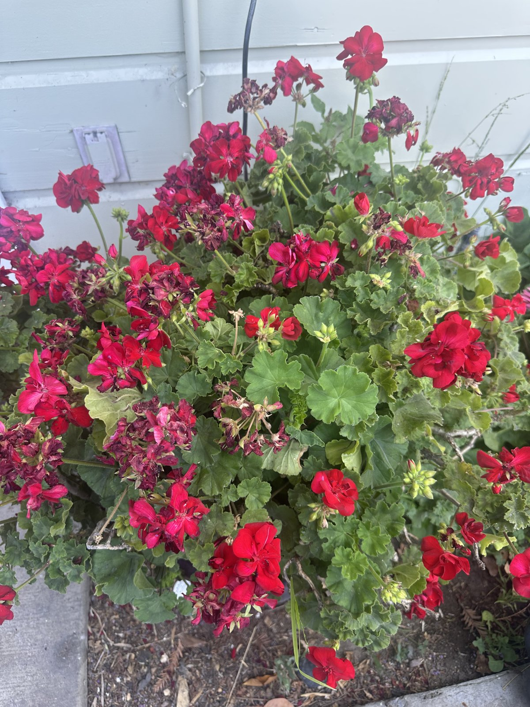

## Context

Red zonal geranium in a portable planter, left by the previous tenant. I've kept it going.
`acquired` is the year it came under my care; exact month unknown.

## Photos

*2026-06*

## Needs

Full sun to part shade; let the soil dry between waterings. Deadhead to keep it blooming.

## Maintenance

- Pruning / deadheading.
- Watering.
- Compost.

## Log

- 2025: inherited from the previous tenant; have been pruning, watering, and adding compost since.
