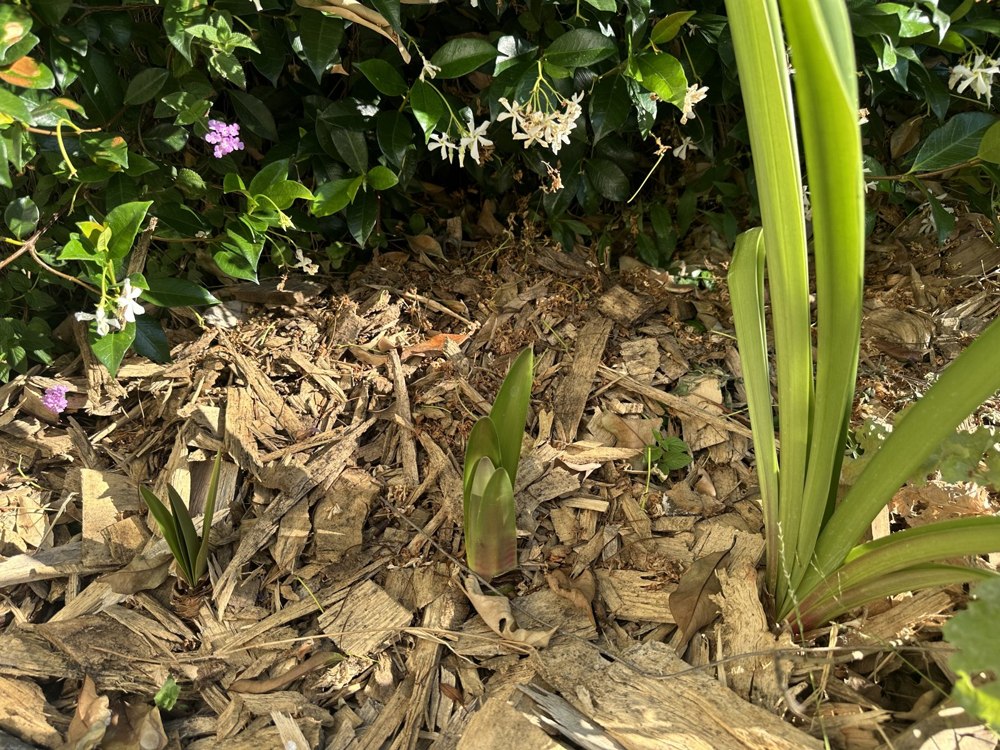

## Context

Four bulbs that originally came waxed (no soil). After the flowers died back, I planted the bulbs in
soil hoping they would rebloom next winter.

## Photos

*2026-06*

## Needs

Bright light; a dry rest period to trigger reblooming. Don't overwater the dormant bulb.

## Maintenance

- Let foliage grow to recharge the bulb after blooming.
- Withhold water for a rest period ahead of the intended winter bloom.

## Log

- 2026-04: planted 4 de-waxed bulbs in soil, hoping for a winter bloom.
