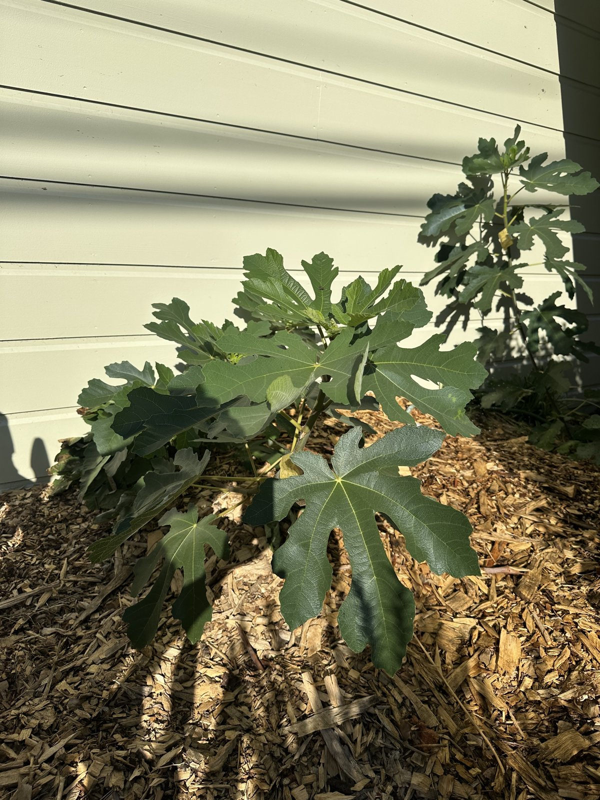

## Context

A volunteer — it propagated on its own in the front, but I was glad to find it and have chosen to keep
and nurture it. Classed as `planted` since I'm establishing it deliberately.

## Photos

*2026-06*

## Needs

Full sun; regular water while young to establish roots.

## Maintenance

- Regular watering.
- Feeding with compost.

## Log

- 2026-02: noticed the natural propagation; began watering and feeding compost.
