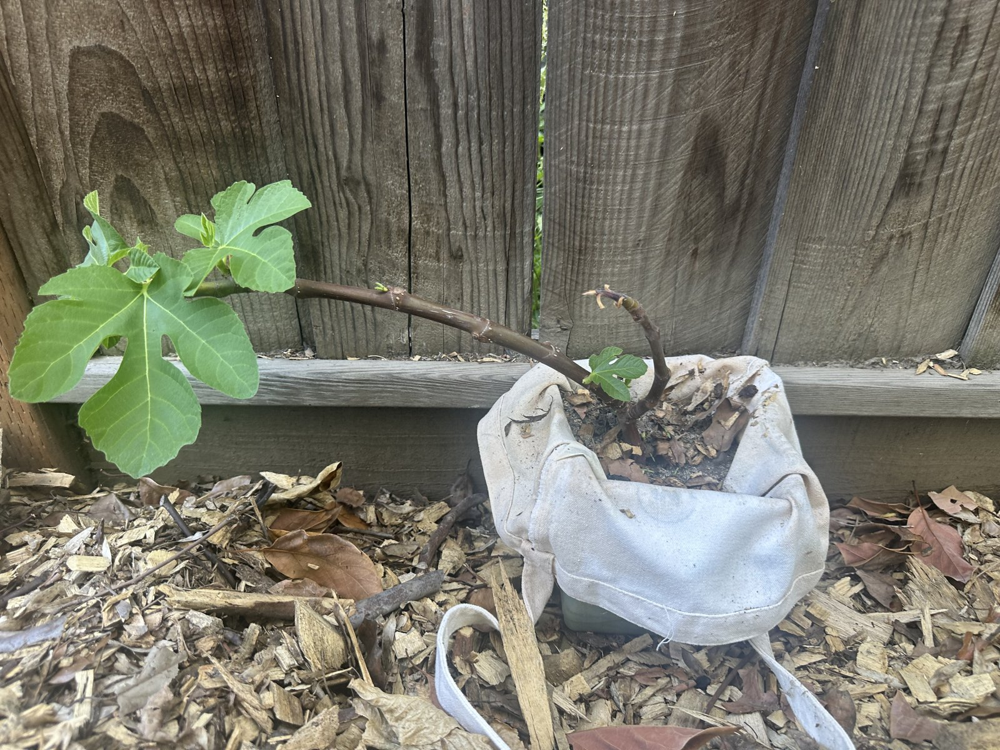

## Context

An air-layer transplant, growing in a portable container. Just pushed out new leaves — still very
small and leaning markedly to one side.

## Photos

*2026-06*

## Needs

Full sun; steady water while the young root system establishes. May need staking to correct the lean.

## Maintenance

- Keep watered while establishing.
- Consider staking to straighten the bent stem.

## Log

- 2026: showed first new leaves after transplant; small and bent sideways.
