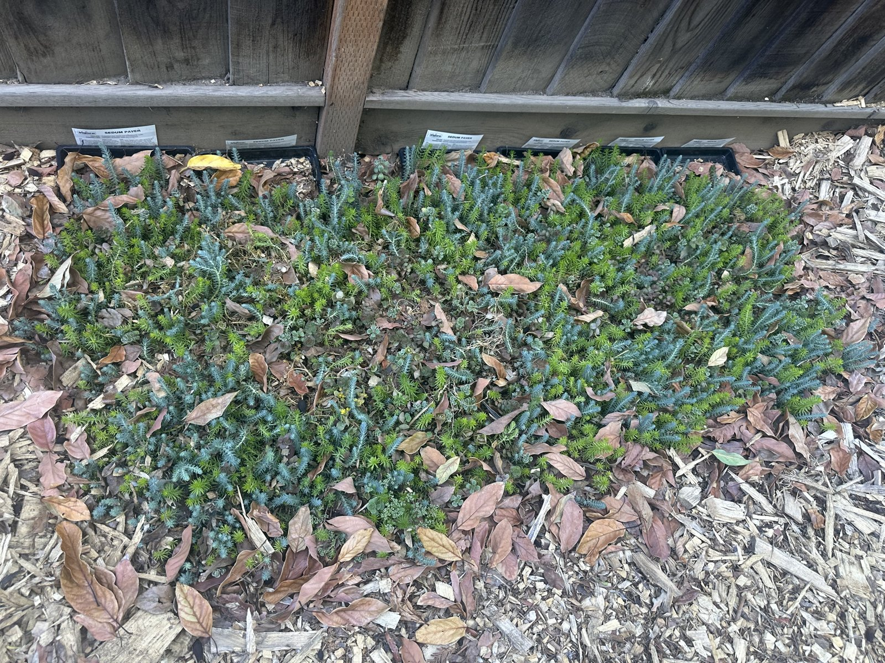

## Context

Planted from trays bought at Home Depot. Has filled in to good ground coverage along the side.

## Photos

*2026-06*

## Needs

Full sun; well-drained soil. Drought-tolerant once established — easy to overwater.

## Maintenance

- Minimal. Divide or trim back if it outgrows its area.

## Log

- 2026-01: planted from Home Depot trays; has since spread to good coverage.
